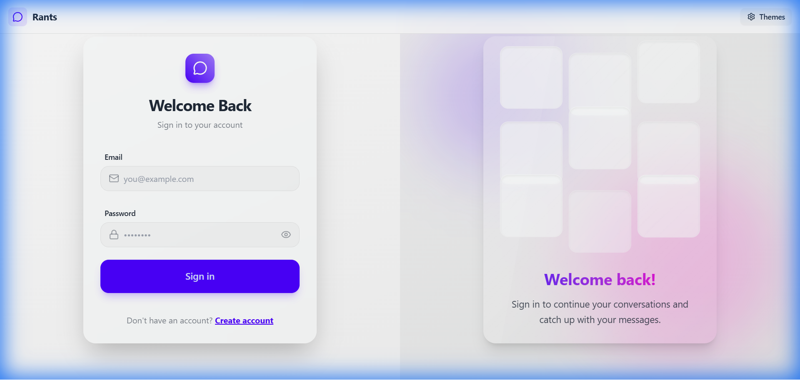
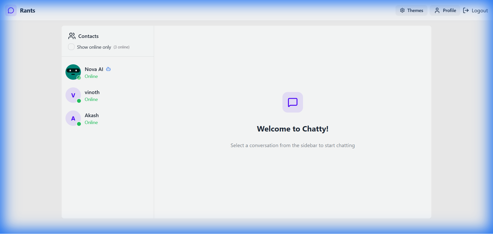
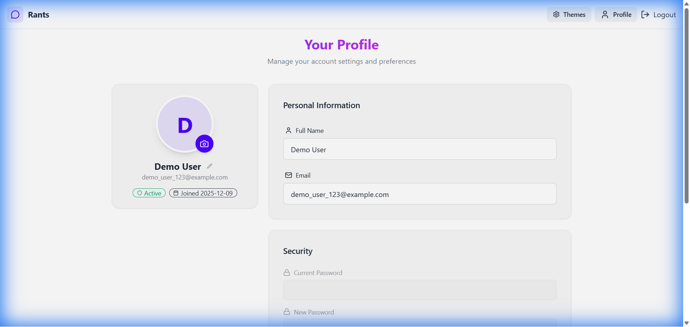

# Real-time Chat Application

A full-stack real-time chat application built with the MERN stack (MongoDB, Express, React, Node.js) and Socket.IO.

## Features

- **Authentication**: JWT-based auth with signup, login, and logout.
- **Real-time Messaging**: Instant messaging using Socket.IO.
- **Online Status**: See who is online in real-time.
- **Image Upload**: Send images in chat (requires Cloudinary).
- **Theming**: Multiple themes support using DaisyUI.
- **Responsive Design**: Mobile-first design with Tailwind CSS.

## Tech Stack

- **Frontend**: React, Vite, Tailwind CSS, DaisyUI, Zustand, Axios.
- **Backend**: Node.js, Express, MongoDB, Socket.IO, JWT, Cookie Parser.

## Setup

1.  **Clone the repository** (if applicable).
2.  **Install dependencies**:
    ```bash
    npm install
    cd frontend && npm install
    cd ../backend && npm install
    ```
3.  **Environment Variables**:
    - Create `.env` in `backend` directory (see `.env.example`).
    - Set `MONGODB_URI`, `JWT_SECRET`, `CLOUDINARY_CLOUD_NAME`, etc.
4.  **Run the app**:
    - Backend: `cd backend && npm run dev`
    - Frontend: `cd frontend && npm run dev`

## Project Structure

- `backend/`: Server-side code.
- `frontend/`: Client-side code.

## Screenshots

### Login Page


### Application Interface


### Profile Page
